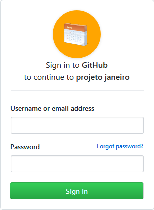

# Janeiro- #ffa500 :date:
Me autodesafiei a produzir (mesmo que simples) um novo projeto todo mês .

### Sobre o projeto 01

Authentication usando GitHub OAuth 2.0 com NodeJS + Express + axios   

## License
